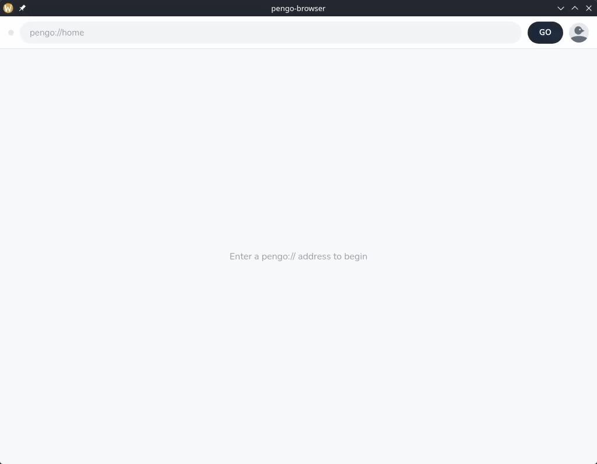

## What Pengo is for

### Before


### After


## Structure

Web for penguins, written from scratch:

| Web for humans | Pengo for PENGUINS         |
| -------------- | -------------------------- |
| HTTP           | the Pengo protocol         |
| DNS            | Pengo DNS server (`:7007`) |
| Chrome         | pengo-browser              |

| Folder           | What                                                                   |
| ---------------- | ---------------------------------------------------------------------- |
| `pengo/`         | the protocol library itself                                            |
| `resolver/`      | DNS client — turns a name into an ip, expects a `:7007` dns server     |
| `cmd/server/`    | serves the folder it's started in, on `:2719`                          |
| `cmd/dns/`       | DNS server that resolves names via `registry.json` on `:7007`          |
| `cmd/client/`    | CLI client                                                             |
| `pengo-browser/` | the browser (Wails: Go backend + JS frontend)                          |
| `sites/`         | example sites — plain folders of files, nothing pengo-specific in them |

Everything under `cmd/` is runnable. The rest is a library.

**Important:** this project changes its core ideas and structure constantly. Code that looks junky now will be fixed, replaced, or quietly deleted like it never existed. There's no roadmap (currently), the author figures things out as he goes. Penguins don't mind as soon as pengo lets them connect

## How it works

`pengo-browser` is a Go app on Wails (similar to Tauri) that opens a window with a web page in it. The JS frontend is the address bar and the page area; the Go backend does the networking using solely Pengo protocol.

Typing `pengo://welcome`:

```
frontend  → hands the address to the Go backend
backend   → splits into host (welcome) + path (/ if none given)
          → asks DNS :7007 where welcome is  → 127.0.0.1:2719
          ← response comes back
frontend  ← renders it
```



Response format - headers, blank line, body:

```
PENGO/0.1
200 OKY
Content-Length:412
Content-Type:text/html

<div>...the page...</div>
```

Nothing new but when you realize it's the only internet for penguins you start to think it's really cool

## Serving files

A site is just a folder. The server starts inside it and reads whatever gets asked for.

Paths are resolved by trying things in order:

```
/cat.png  → cat.png exists  → serve it
/about    → no about        → about.html exists → serve that
/         → /index          → index.html
nothing?  → 404.html, or a built-in one if the site has none
```

So pages don't need `.html` in the address, and files keep theirs. The client sends the path exactly as typed, the server does the guessing.

Bodies are bytes now instead of text, so images work.

The browser reads it and picks: html gets rendered, images get turned into a `data:` url. There's base64 in the middle because Wails talks to the frontend in JSON, and JSON can't hold raw bytes.

## vs HTTP

The whole "browser -> pengo protocol -> server" flow currently doesn't differ from http much. But.. Pengo doesn't really have TLDs:
`registry.json` currently is one flat file, name -> ip.

## What pengo doesn't replace (spoiler: JS is staying)

The web stack is the one piece Pengo deliberately doesn't replace.

For two reasons:

- **HTML/CSS/JS is a web standart** and every platform already ships an engine that renders them. Pengo is a separate **net**, not a different way to write a page. Anyone who can build a website can build a pengo site. Pengo is not trying to be different for the sake of being different.

But most importantly:

- **A rendering engine isn't part of a "net".** Layout, text shaping, fonts, the CSS, a JS engine. The hardest part of a browser and the part with nothing to
  do with the net. Writing it would eat the project and pengo would never get past the address bar.

P.S browser was migrated to TypeScript

## Running

Three terminals:

```bash
cp cmd/dns/registry.example.json cmd/dns/registry.json
go run ./cmd/dns                          # DNS
cd sites/welcome && go run ../../cmd/server   # a site — cwd is what gets served
cd pengo-browser && wails dev             # browser
```

The server serves whatever folder you start it in, so `cd` into your own folder of files and it works — no config, nothing to register.

Then type `pengo://127.0.0.1`. For names instead of IPs, add them to `registry.json`.
