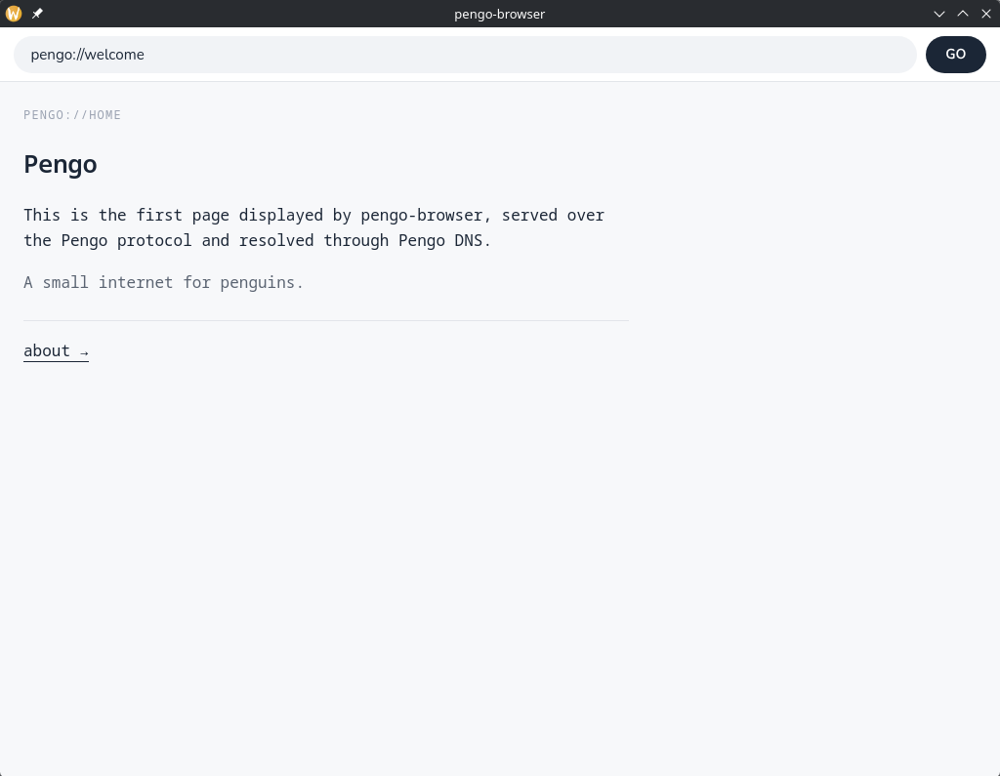

## What Pengo is for

### Before


### After


## Structure

Web for penguins, written from scratch:

| Web for humans | Pengo for PENGUINS         |
| -------------- | -------------------------- |
| HTTP           | the Pengo protocol         |
| DNS            | Pengo DNS server (`:7007`) |
| Chrome         | pengo-browser              |

| Folder           | What                                             |
| ---------------- | ------------------------------------------------ |
| `protocol/`      | shared library — builds and reads Pengo messages |
| `cmd/server/`    | serves pages on `:2719`                          |
| `cmd/dns/`       | resolves names via `registry.json` on `:7007`    |
| `cmd/client/`    | CLI client                                       |
| `pengo-browser/` | the browser (Wails: Go backend + JS frontend)    |

Everything under `cmd/` is runnable. The rest is a library.

**Important:** this project changes its core ideas and structure constantly. Code that looks junky now will be fixed, replaced, or quietly deleted like it never existed. There's no roadmap (currently), the author figures things out as he goes. Penguins don't mind as soon as pengo lets them connect

## How it works

`pengo-browser` is a Go app on Wails (similar to Tauri) that opens a window with a web page in it. The JS frontend is the address bar and the page area; the Go backend does the networking using solely Pengo protocol.

Typing `pengo://welcome`:

```
frontend  → hands the address to the Go backend
backend   → splits into host (welcome) + path (/home)
          → asks DNS :7007 where welcome is  → 127.0.0.1:2719
          ← response comes back
frontend  ← renders it
```



Response format - headers, blank line, body:

```
PENGO/0.1
200 OK
Content-Length:412

<div>...the page...</div>
```

Nothing new but when you realize it's the only internet for penguins you start to think it's really cool

## vs HTTP

The whole "browser -> pengo protocol -> server" flow currently doesn't differ from http much. But.. Pengo doesn't really have TLDs:
`registry.json` currently is one flat file, name -> ip.

## Running

Three terminals:

```bash
cp cmd/dns/registry.example.json cmd/dns/registry.json
go run ./cmd/dns              # DNS
go run ./cmd/server           # a site
cd pengo-browser && wails dev # browser
```

Then type `pengo://127.0.0.1/home`. For names instead of IPs, add them to `registry.json`.
